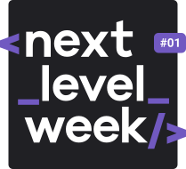

<h1 align="center">
    
</h1>

## Project

Ecoleta is a project developed based on international environment week.  
This project aims to connect people to companies that collect specific waste, such as light bulbs, batteries, and cooking oil.

<h1 align="center">
    
</h1>

## Technologies

- [Node.js][nodejs]
- [Express][express]
- [TypeScript][typescript]
- [React][reactjs]
- [React Native][rn]
- [Expo][expo]

## How To Use

From your command line:

### Backend API

```bash
# Clone this repository
$ git clone https://github.com/mgiovani/ecoleta-nlw

# Go into the repository
$ cd ecoleta/backend

# Install dependencies and run migrations
$ make install

# Start server on port 3333
$ make run
```

### Front-end

```bash
# Clone this repository
$ git clone https://github.com/mgiovani/ecoleta-nlw

# Go into the repository
$ cd ecoleta/frontend

# Install dependencies
$ make install

# Run on port 3000
$ make run
```

### Mobile

```bash
# Clone this repository
$ git clone https://github.com/mgiovani/ecoleta-nlw

# Go into the repository
$ cd ecoleta/mobile

# Install dependencies
$ make install

# Run
$ make run

# Expo will open. Scan the QRcode on the terminal or expo page
```

## More Screenshots

<h1 align="center">
    
    
    
    
</h1>

[nodejs]: https://nodejs.org/
[express]: https://github.com/expressjs/express
[typescript]: https://www.typescriptlang.org/
[expo]: https://expo.io/
[reactjs]: https://reactjs.org
[rn]: https://facebook.github.io/react-native/
